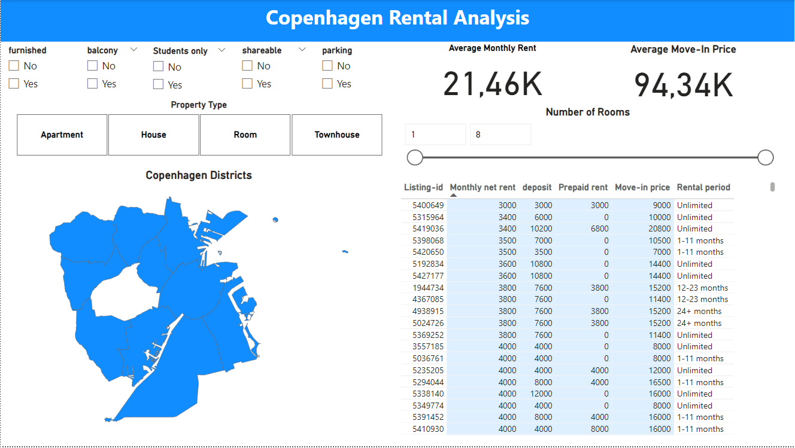
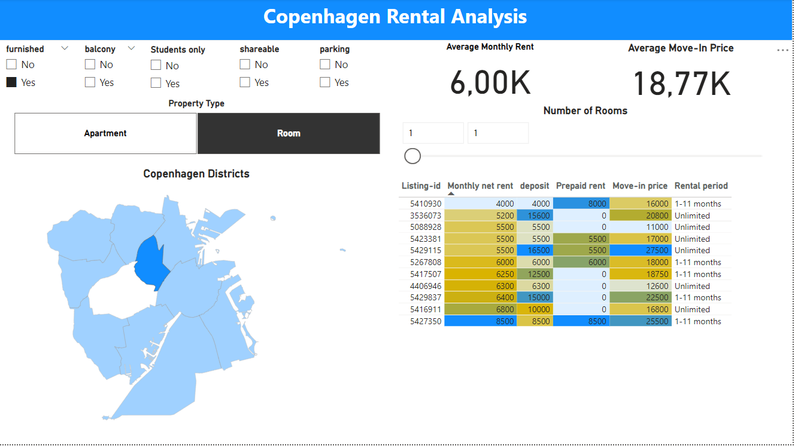
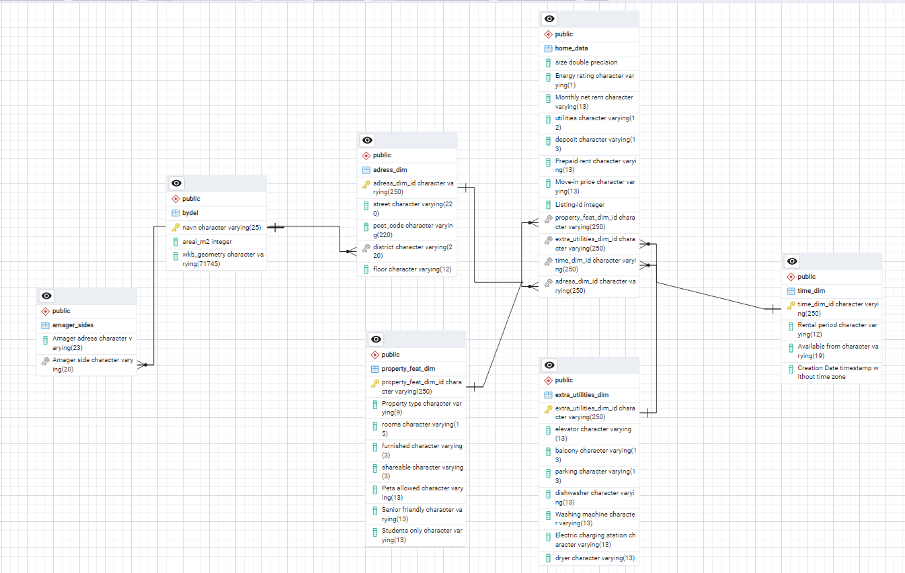
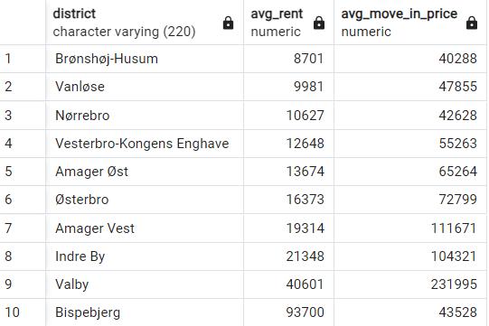
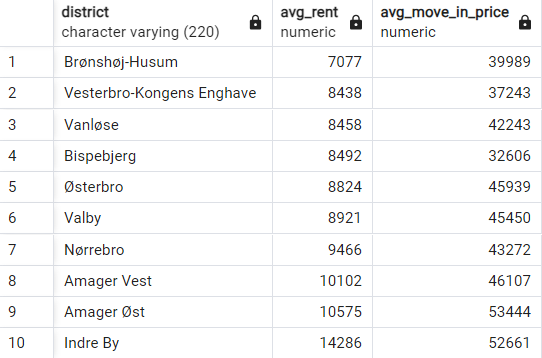
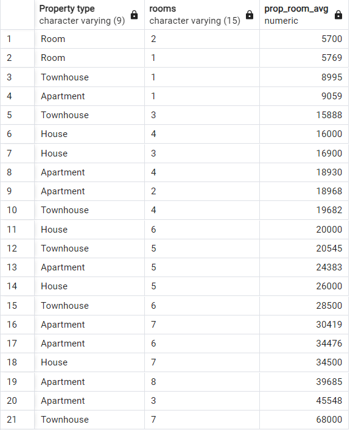
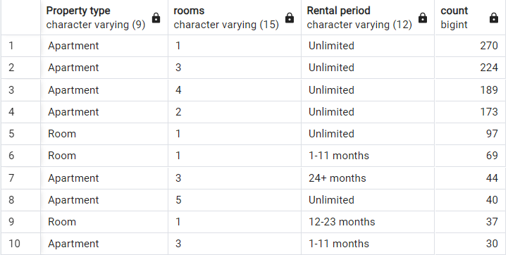

# Copenhagen Home Rental Analysis

## Static View of the report 

Download report here: https://github.com/Alexandros-Korolis/Copenhagen_Home_Rental_Analysis/blob/main/Report.pbix

## Purpose 
The purpose of this project is to analyze rental advertisements for apartments and rooms in Copenhagen's 10 districts. Especially :
- How much is the average net rent and move-in price per district ?
- What about one room apartments (average monthly net rent and move-in price)?
- Whats the average net rent per type of property and number of rooms ?
- Does floor has an effect on monthly net rent on average for one room apartments ?
- What percentage of the total number of properties per district are students only ? 
- Which district has the hightest percentage of student only type of properties ?
- In which district is more likely to find a house (any type) with a balcony ?
- Which is the most pet friendly district ?
- What is the most common rental period per type of apartment ?
- Which are the top 5 most Senior Friendly streets ?

## Steps
&middot;STEP 1: The first stage of the project involves obtaining data through web scraping. This will be done by scraping housing advertisements from boligportal.dk, using filter criteria focused on Copenhagen. 

&middot;STEP 2: Afterward, I will design and create a PostgreSQL database and migrate it to the cloud.

&middot;STEP 3: Data cleaning using SQL.

&middot;STEP 4: Finally, I will connect Power BI to the PostgreSQL database, create an interactive dashboard focused on Copenhagen's districts, and report the findings.

## File Structure of repository 
|-- README.md
|-- database_design/
|   |-- create_tables_insert_data.sql   # SQL script to create tables and insert initial data
|   |-- database_design_cleaning.sql    # SQL script for database design and additional cleaning tasks
|-- eda/
|   |-- EDA_data_exploration.sql        # SQL script for exploratory data analysis
|-- web_scraping/
|   |-- ads_data.xlsx                   # Result of the web scraping in Excel format
|   |-- amager_sides.xlsx               # Additional scraped data specific to Amager
|   |-- bydel.xlsx                      # Data for different districts (bydel) in Copenhagen
|   |-- Home_scrape.ipynb               # Jupyter Notebook for the web scraping process

## About the database 

The outcome of the web scraping was one .xlsx file with various columns. I designed the database with one fact table (home_data) and multiple dimension tables, using a star schema where each dimension table has a one-to-many relationship with the fact table. Initially, I created three tables in the database and imported data from the web scraping results, bydel.xlsx and amager_sides.xlsx (see create_tables_insert_data.sql). Then, I split the data into fact and dimension tables, established relationships and constraints, and performed data cleaning (see database_design_cleaning.sql).

## Findings/Report
<strong> 1. How much is the average net rent and move-in price per district ? </strong>

<strong>2. What about one room apartments ?</strong>

<strong>3. What about one room apartments ?</strong>

<strong>4. Does floor has an effect on monthly net rent on average for one room apartments ?</strong>

We generally observe that, regardless of the type of apartment and the number of rooms, lower floors tend to have a lower average monthly net rent.

<strong>5. What percentage of the total number of properties per district are students only ?</strong>
<strong>6. Which districts have the hightest percentage of student only type of properties (Top 3)?</strong>
We observe that the highest percentage of student only type of properties are in the following districts:
Bispebjerg (15% of the total apartments in this district are student only),
Amager East (4.95% of the total apartments in this district are student only),
Vesterbro - Kongens Enghave (4.76% of the total apartments in this district are student only)

<strong>7. In which district is more likely to find a house (any type) with a balcony ?</strong>
According to the data in Amager Vest (~87% of total apartments in this district have balcony),
Vesterbro-Kongens Enghave (53%),Indre By (~48%)

<strong>8. Which is the most pet friendly district ?</strong>
Amager Vest, Amager East and Brønshøj-Husum (50%, 43%, 30% respectively of total apartments in these districts are pet friendly)

<strong>8. Which is the most pet friendly district ?</strong>

<strong>9. Which are the top 5 most Senior Friendly streets ?</strong>
Top 5 most Senior Friendly streets are : Islands Brygge, Irlandsvej, Englandsvej, Bådehavnsgade and Else Alfelts Vej.

## Future Plans 
Future plans include automating the entire process of web scraping, storing data into the database, and generating reports by refreshing Power BI.

