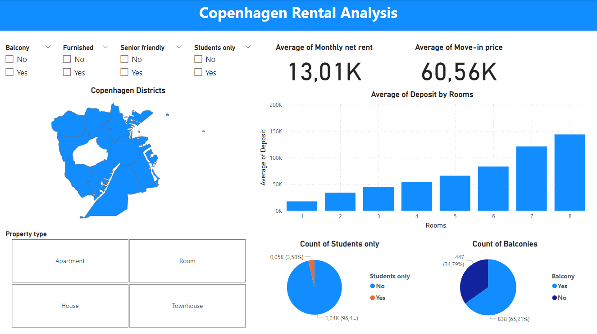

# Copenhagen Home Rental Analysis

## Static View of dashboard 

Download interactive dashboard here: https://github.com/Alexandros-Korolis/Copenhagen_Home_Rental_Analysis/blob/main/Report.pbix

## Purpose 
The purpose of this project is to analyze various rental advertisements for properties (apartments/rooms) in Copenhagen. I will answer questions related to:
- How do prices change depending on the type of house?
- Which areas contain the largest number of student-friendly apartments/rooms?
- How do prices change per district?
- What is the average availability time (in days) per district?
- What kind of additional utilities are typically included in the price?

## Steps
&middot;The first stage of the project consists of obtaining data by web scraping. This is done by scrapping the house ads found on boligportal.dk with filter criteria focused on Copenhagen. 

&middot;Afterwards, data cleaning and exploration were performed by creating a PostgreSQL database locally and manipulating it using SQL.

&middot;Finally, create an interactive dashboard (focused on top Copenhagen Districts)and report the findings.

## Information about the files: 
1) 'Home_scrap' file contains the code of the web scraping process done in Python.
2) ads_data.csv file contains tabular data. These are the data obtained by webscrapping.
3) 'Data_Cleaning_SQL' file contains the code for data cleaning process done using SQL.
4) clean_data_db.csv file contains cleaned data.
5) 'Data_Exploration_SQL' file contains the code for data exploration done using SQL.
6) 'amager_sides' file contains data about whether an adress in in amager east or west
7) 'bydel' file contains geodata about top districs in Copenhagen
8) 'districts_correct' same as above but in json format. Need it in order to present a visual map of Copenhagen.
9) 'top_kbh_districs' contains data about the top districs in Copenhagen.
10) 'Report' is Power BI report/responsive dashboard.

## Findings/Report
- For the purpose of this analysis, with the term Copenhagen districts I describe the following areas/districts in Copenhagen: Amager East/West, Bispebjerg, Brønshøj-Husum, Indre By, Nørrebro, østerbro, Valby, Vanløse. While with the term surroundings I describe the areas around Copenhagen.

- Data shows that the average monthly net rent for one room in Copenhagen districts is
around 5600dkk, average deposit around 10000dkk average move-in price 18940dkk.

- Cheapest Copenhagen district to rent one room is Bispebjerg, with average monthly-net rent 4640dkk.

- Bispebjerg has the lowest average net monthly rent for one room apartments in Copenhagen districs, with approximately 7720dkk. 

- Couples or two friends will need on average to pay 13220dkk per month, if they plan to rent in one of Copenhagen districts. In this case, the majority of the rental properties will be unfurnished.

- Properties with balcony on average tend to be a bit more expensive that the ones without. (Both in Copenhagen districts and surroundings)

- Vesterbro seems to have the highest amount of student-only type of properties, in Copenhagen and each surroundings. Whereas, the cheapest districts in Copenhagen for students seems to be Bispebjerg, Brønshøj-Husum, Vanløse ( monthly average net rent: 4712dkk, 4896dkk, 4999dkk).

- On average one has to start searching for a Townhouse 74 days before the desired move-in date, for Room(s) 85 days before, Apartment 88 days before and House 99 days before.
